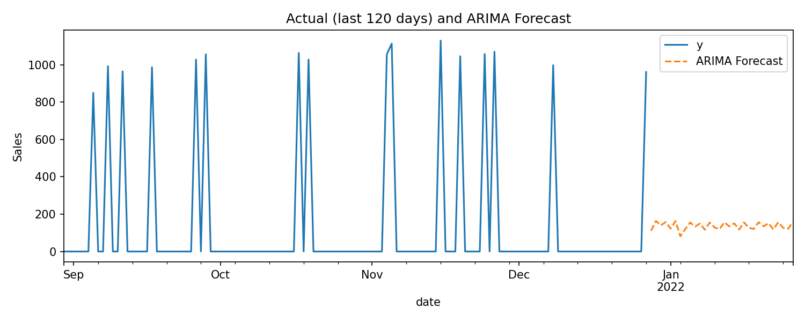

\# Retail Forecasting — Prophet \& ARIMA + Power BI

\*\*Tech:\*\* Python (pandas, statsmodels, prophet), Power BI, Git  

\*\*Task:\*\* Demand forecasting for retail store-item time series and interactive visualization

\## Project summary

Automated data ingestion and time-series forecasting using ARIMA and Prophet.  

Built a Power BI dashboard to compare actual sales vs forecasts and provide KPIs and drill-down exploration.

\## Demo screenshot

!\[Actual vs ARIMA Forecast](images/forecast\_chart.png)

\## Files produced by the run

\- outputs/input\_series.csv

\- outputs/forecast\_arima.csv

\- outputs/forecast\_prophet.csv

\## How to reproduce (quick)

\### 1. Activate venv:

.\\venv\\Scripts\\activate

## 📈 Forecast Visualization

Below is the forecast comparison between the **actual sales (last 120 days)** and the **ARIMA 30-day forecast**:

\### 2. Run forecasting:

python forecast.py --input data/retail\_sales.csv --store 101 --item 1 --periods 30

\### 3. Load into Power BI:

Import:

\- outputs/input\_series.csv  

\- outputs/forecast\_arima.csv  

\- outputs/forecast\_prophet.csv  

\### 4. Import theme:

View → Themes → Browse for themes → harsha\_theme.json

\### 5. Build Actual vs ARIMA chart:

\- X-axis → date (not Date Hierarchy)

\- Y-axis → Actual + ARIMA Forecast

\- Format → Lines:

&nbsp; - Actual: #1f77b4 (blue), solid, width 2  

&nbsp; - ARIMA Forecast: #ff7f0e (orange), dashed, width 3  

\- Format → Markers → Off  

\- Format → Legend → On (Right)

\### 6. Export PNG

File → Export → Export to PNG → save as `images/forecast\_chart.png`

\## Git commands

git add README.md harsha\_theme.json

git commit -m "Add README + theme"

git push origin main

After exporting PNG:

git add images/forecast\_chart.png

git commit -m "Add dashboard screenshot"

git push origin main

